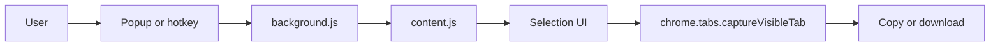

<div align="center">

# Lasso

**Chrome extension for fast, precise screenshots**

`lasso` · Manifest V3 · Chrome / Brave / Edge

</div>

> **Capture without leaving the page.** Pick one or more elements, drag a region, grab the viewport, or stitch a full-page shot. Copy or download from the selection toolbar.

Lasso is a lightweight browser extension for screenshot workflows that need more control than a full-tab capture. It runs entirely in your browser. No accounts, no uploads, no backend.

**[Get started](#getting-started)**

---

## Table of Contents

- [Getting Started](#getting-started)
- [Capture modes](#capture-modes)
- [Keyboard shortcuts](#keyboard-shortcuts)
- [How it works](#how-it-works)
- [Permissions](#permissions)
- [Development](#development)
- [License](#license)

## Getting Started

### 1. Load unpacked (development)

1. Clone this repository.
2. Open `chrome://extensions` (or your Chromium browser equivalent).
3. Enable **Developer mode**.
4. Click **Load unpacked** and select the project folder.
5. Pin **Lasso** from the extensions menu.

### 2. First capture

**Option A.** Press `Ctrl+Shift+S` (`Cmd+Shift+S` on macOS) to open the capture preview.

**Option B.** Click the Lasso toolbar icon and choose a mode from the popup.

In preview mode you can hover to pick an element, **Shift+click** to add more elements into one combined selection, drag to draw a region, or use **Save visible** / **Save full page** in the top-right panel.

## Capture modes

| Mode | How to start | What it does |
| --- | --- | --- |
| **Preview** | `Ctrl+Shift+S` | Dimmed overlay. Pick (Shift+click to add elements), freestyle draw, visible, or full page. |
| **Visible** | Popup → Visible | Locks the current viewport. Resize, then copy or download. |
| **Full page** | Popup → Full page | Scrolls and stitches the page. Optional crop before export. |
| **Pick** | Popup → Pick | Hover elements, click to lock. Shift+click to add more into one bounding box. |
| **Freestyle** | Popup → Freestyle | Drag a custom box on the page. |

After a selection is locked, use the toolbar to **copy** (`Ctrl+C`) or **download** (`Ctrl+S`). Press `Esc` to cancel. Multi-element picks must fit in one viewport shot; if the combined box is too large, Lasso shows an error instead of cropping silently.

## Keyboard shortcuts

| Shortcut | Action |
| --- | --- |
| `Ctrl+Shift+S` / `Cmd+Shift+S` | Open capture preview |
| `Esc` | Cancel capture |
| `Ctrl+C` / `Cmd+C` | Copy locked selection (while toolbar is active) |
| `Ctrl+S` / `Cmd+S` | Download locked selection (while toolbar is active) |

If `Ctrl+Shift+S` conflicts with a browser shortcut, change or disable the conflicting binding in your browser shortcut settings, or rebind Lasso at `chrome://extensions/shortcuts`.

## How it works



1. **Popup or command** tells the background worker which capture mode to start.
2. **Content script** renders the overlay, selection box, and toolbar on the active tab.
3. **Background** captures the tab (and scrolls for full-page stitches), then asks the content script to crop or stitch.
4. **Export** writes to the clipboard or triggers a download. Images stay on your machine.

## Permissions

| Permission | Why |
| --- | --- |
| `activeTab` | Capture the tab you are working in. |
| `scripting` | Inject capture UI when needed. |
| `downloads` | Save PNG files. |
| `clipboardWrite` | Copy PNG to clipboard. |
| `<all_urls>` | Run on any site you screenshot and handle the global hotkey without opening the popup first. |

Lasso does not send page content to any external service.

## Development

Project layout:

| File | Role |
| --- | --- |
| `manifest.json` | Extension manifest (MV3). |
| `messages.js` | Shared message type constants. |
| `background.js` | Capture orchestration and downloads. |
| `content.js` | Content-script entry and message dispatch. |
| `capture-pipeline.js` | Crop, stitch, and export. |
| `fixed-elements.js` | Hide and restore fixed/sticky elements. |
| `selection-ui.js` | Overlay, selection, and toolbar UI. |
| `content.css` | In-page capture chrome. |
| `hotkey.js` | `Ctrl+Shift+S` listener on each tab. |
| `popup.html` / `popup.js` / `popup.css` | Toolbar popup. |
| `icons/` | Extension icons (`icon.svg` source, PNG sizes for the store). |

Regenerate PNG icons from the SVG source (requires `librsvg`):

```bash
./scripts/build-icons.sh
```

After code changes, reload the extension on `chrome://extensions`.

## License

MIT © [Pratham Dubey](https://github.com/prathamdby), 2026. See [LICENSE](LICENSE).
